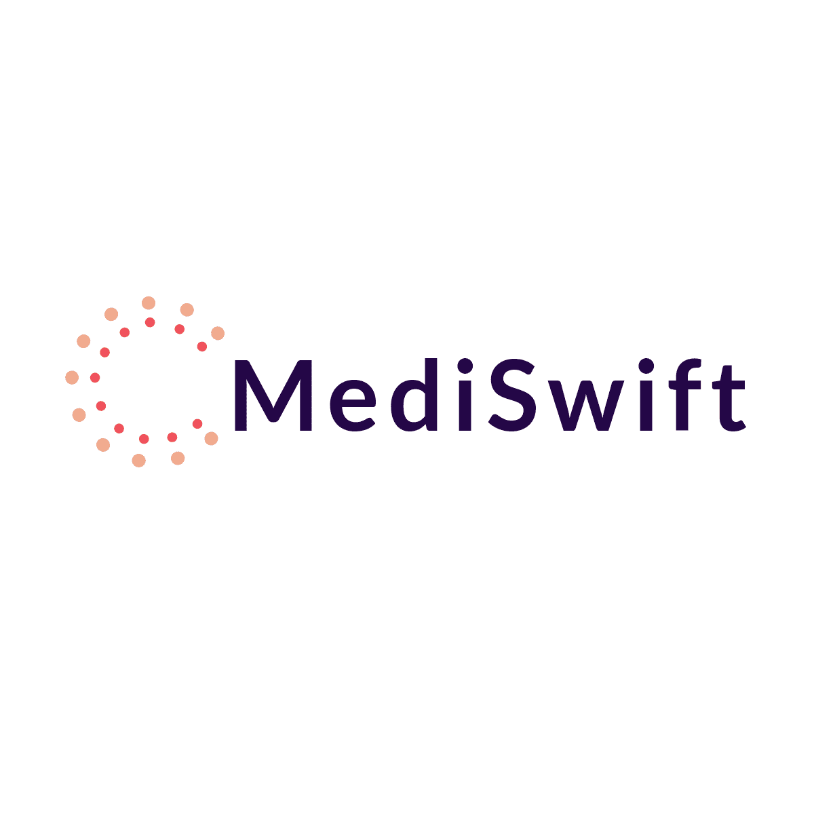

 

# MediSwift

MediSwift is a web application that aims to provide a convenient platform for individuals with allergies to easily purchase allergy medications. The platform is built using React and TypeScript, while the database is powered by MongoDB with the Mongoose library.

## Introduction

MediSwift is designed to streamline the process of purchasing allergy medications for people with allergies. By leveraging modern technologies like React, the platform offers a user-friendly interface that allows users to browse through a wide range of allergy medications, and place orders.  
## Approach

Our development process for creating MediSwift followed a structured and iterative approach. Here's a breakdown of the steps we took to bring the project to life:

Approach
Our development process for creating MediSwift followed a structured and iterative approach. Here's a breakdown of the steps we took to bring the project to life:

1. Model-View-Controller (MVC) Setup
We initiated the development process by setting up the foundational architecture of the application using the Model-View-Controller (MVC) pattern. This pattern helps us to organize the codebase and separate concerns, allowing for better maintainability and scalability. The MVC pattern involves the following components:

Model: We defined the data models for allergy medications, user information, and shopping cart items. These models served as the foundation for storing and managing data within the application.

View: We created the user interface components responsible for displaying allergy medications, user authentication forms, and the shopping cart. The views are designed to be user-friendly and intuitive.

Controller: The controller acts as an intermediary between the model and the view. It handles user interactions, processes requests, and manages the flow of data between the model and view components.

2. Medications Display Page
After setting up the MVC architecture, we focused on implementing the page that displays allergy medications. Users can browse through a wide range of allergy medications, view details, and choose the ones they need. We ensured that the medications are presented in an organized and easily accessible manner to enhance the user experience.

3. User Authentication (Login and Signup)
Next, we added a crucial feature to the application - user authentication. This allowed users to sign up for new accounts and log in using their credentials securely. By implementing authentication, we ensure that each user's data and shopping cart information are kept private and accessible only to the respective user.

4. Shopping Cart
With the medications display page and authentication in place, we proceeded to create the shopping cart feature. Users can now add allergy medications to their shopping cart, view the items they have added, modify quantities, and remove items as needed. The shopping cart functionality provides a seamless shopping experience, making it easy for users to review and manage their selected medications before proceeding to checkout.

By following this systematic approach and continuously iterating on our development, we were able to build MediSwift - a user-friendly platform that simplifies the process of purchasing allergy medications for users with allergies.
## Technologies Used

## What's Next?

While MediSwift has already come a long way, there are exciting plans for its future development. We have identified some key areas that we aim to enhance and features we intend to implement to make MediSwift even more robust and user-friendly.

1. Shopping Cart Enhancements
The shopping cart functionality of our website is not yet complete so the first plan is to finalize that.

2. Checkout and Payment Integration with Stripe
One of our immediate goals is to incorporate a seamless checkout and payment process using Stripe. Stripe is a widely popular payment gateway known for its ease of use, extensive functionality, and secure payment processing. By integrating Stripe into MediSwift, users will be able to pay for their selected allergy medications securely and efficiently. This integration will further enhance the overall user experience and build trust with our users.
## Authors

@ArcherHeffern

@bisrat415
## Badges

